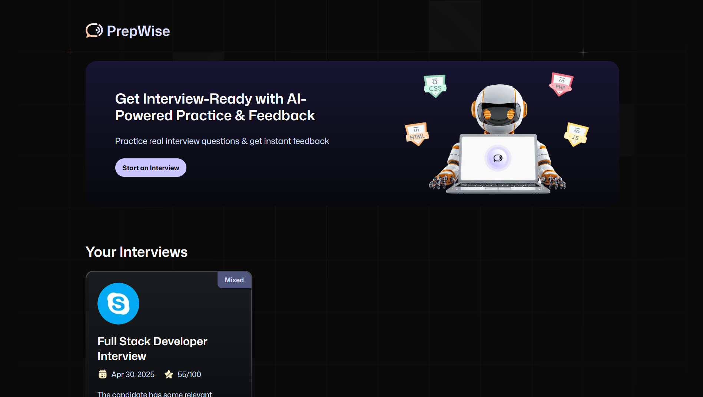

# 🤖 Prepwise – AI-Powered Interview Preparation

**Prepwise** is a modern web platform that simulates job interviews using AI voice assistants and provides instant feedback to help users improve. Built with **Next.js**, **Firebase**, and **Vapi AI**, it's designed to integrate powerful AI models with a sleek, responsive interface for a seamless user experience.



---

## ⚙️ Tech Stack

- **Next.js** – Frontend and backend logic
- **Firebase** – Authentication and real-time database
- **Tailwind CSS** – Styling
- **Vapi AI** – AI voice agents
- **shadcn/ui** – Prebuilt UI components
- **Google Gemini** – AI feedback generation
- **Zod** – Schema validation

---

## 🔋 Features

- 🔐 **Authentication**: Email/password sign-up and sign-in via Firebase
- 🎙️ **AI Interviews**: Conduct interviews using AI voice agents (Vapi + Gemini)
- 🧠 **Instant Feedback**: Get immediate, AI-generated insights on your performance
- 📄 **Interview Page**: Real-time transcripts and feedback during interview sessions
- 🧭 **Dashboard**: Track, view, and manage all your past interviews
- 📱 **Responsive UI**: Seamless experience across all device sizes
- ♻️ **Modular Architecture**: Clean, reusable code structure using best practices

---

## 🤸 Quick Start

### 📦 Prerequisites

Ensure the following are installed:

- Git
- Node.js
- npm

### 🔧 Clone the Repository

```bash
git clone https://github.com/SimpleCyber/Mock-AI-Interview-.git
cd Mock-AI-Interview-
```

### 📥 Install Dependencies

```bash
npm install
```

### ⚙️ Set Up Environment Variables

Create a `.env.local` file in the root directory and add your API keys:

```env
NEXT_PUBLIC_VAPI_WEB_TOKEN=
NEXT_PUBLIC_VAPI_WORKFLOW_ID=

GOOGLE_GENERATIVE_AI_API_KEY=

NEXT_PUBLIC_BASE_URL=

NEXT_PUBLIC_FIREBASE_API_KEY=
NEXT_PUBLIC_FIREBASE_AUTH_DOMAIN=
NEXT_PUBLIC_FIREBASE_PROJECT_ID=
NEXT_PUBLIC_FIREBASE_STORAGE_BUCKET=
NEXT_PUBLIC_FIREBASE_MESSAGING_SENDER_ID=
NEXT_PUBLIC_FIREBASE_APP_ID=

FIREBASE_PROJECT_ID=
FIREBASE_CLIENT_EMAIL=
FIREBASE_PRIVATE_KEY=
```

> 💡 Replace the placeholders with your actual Firebase, Vapi, and Gemini API credentials.

### 🚀 Run the Development Server

```bash
npm run dev
```

Open [http://localhost:3000](http://localhost:3000) in your browser to use the app.

---

## 🌐 Live Demo

Check out the live demo: [https://mock-ai-interview-nine.vercel.app/](https://mock-ai-interview-nine.vercel.app/) *(replace this with your actual deployed link)*

---

## 📂 Project Structure Highlights

- `/app` – Application routes and pages (Next.js App Router)
- `/components` – Reusable UI components (styled with Tailwind & shadcn/ui)
- `/lib` – Utilities and Firebase configuration
- `/public` – Static assets (including demo image)
- `/styles` – Global and custom styles


---

## 🙌 Author

Made with ❤️ by [Satyam Yadav](https://github.com/SimpleCyber)
